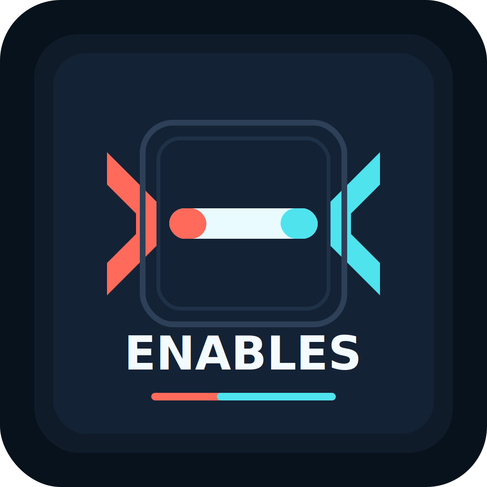

# Enables

**Make Claude Code work with almost any AI provider.**

Enables is a lightweight, high-performance local proxy that lets Claude Code sign in through an Anthropic-compatible local endpoint while routing model requests to your chosen upstream provider (DeepSeek, Google Gemini, OpenAI, Groq, Ollama, OpenRouter, xAI, Mistral, and more).

Built by **Lean Progress IQ** and **Dusan Milosavljevic**, builder of **Aura Code** and **Aura Pulse**. Enables gives developers complete freedom to select, swap, and control the models behind their coding agents.


---

<p align="center">
  
</p>

```text
      ◢◤                               ◢◤
   ╭─────────────────────────────────────────────────╮
   │   AURA   CODE                                   │
   │        E N A B L E S                            │
   │    local gateway for Claude Code                │
   ╰─────────────────────────────────────────────────╯
      ◥◣                               ◥◣
```

---

## Quickstart & User Manual

### 1. Installation

Build from source or link locally:

```bash
git clone https://github.com/DusanCar-sudo/enables.git
cd enables
npm install
npm run build
npm run global # or: npx tsx src/index.ts
```

---

### 2. Running Enables

Start Enables from your terminal:

```bash
enables
```

You will see the interactive terminal menu:

1. **Select Provider**: Choose from DeepSeek, Google Gemini, OpenAI, Ollama, OpenRouter, Groq, xAI, Xiaomi MiMo, Zhipu GLM, or a custom OpenAI-compatible endpoint.
2. **Enter API Key**: Paste your provider API key (hidden prompt) or rely on environment variables (e.g. `DEEPSEEK_API_KEY`, `GOOGLE_API_KEY`, `OPENAI_API_KEY`).
3. **Select Target Model**: Choose the model you want to power Claude Code (e.g., `gemini-2.5-flash`, `deepseek-chat`, `gpt-4o`, `qwen2.5-coder:32b`).
4. **Start Proxy**: Enables automatically scans for an open TCP port (starting at `8080`, falling back to `8081`, `8082`, etc. if occupied) and launches Claude Code with the local proxy configured.

---

### 3. Connecting Claude Code to Enables

When Claude Code launches through Enables, follow these steps during initial login:

#### Step A: Choose Login Method in Claude Code

When Claude Code prompts:

```text
Select login method:
  1. Claude account with subscription · Pro, Max, Team, or Enterprise
❯ 2. Anthropic Console account · API usage billing
  3. 3rd-party platform · Amazon Bedrock, Microsoft Foundry, or Vertex AI
```

👉 **Select `2. Anthropic Console account · API usage billing`**.

> **Why?** Option 1 (subscription login) attempts web OAuth authentication through Anthropic servers. Option 2 instructs Claude Code to use API Key authentication, which routes through your local Enables proxy endpoint (`ANTHROPIC_BASE_URL=http://localhost:<port>`).

#### Step B: API Key Prompt in Claude Code

When Claude Code prompts for an API Key, press **Enter** or type `dummy`. Enables manages your real provider API key securely in your local configuration (`~/.enables.json`).

#### Step C: Choosing a Model in Claude Code (`/model`)

Inside Claude Code, you can run `/model` or keep the default selection:

👉 **Select `Sonnet` (default)**.

> **Why?** Enables automatically advertises standard Claude model identifiers (`claude-sonnet-4-6`, `claude-opus-4-8`, `claude-3-7-sonnet-20250219`, etc.) on the `/v1/models` endpoint to satisfy Claude Code's model validation. When requests arrive at the proxy, Enables transparently translates and routes the request to your configured upstream model (e.g., Google Gemini 2.5 Flash, DeepSeek V3, GPT-4o).

---

### 4. Automatic Free Port Detection

Enables includes an integrated port scanner and generator. If port `8080` is currently used by another process or proxy instance, Enables will:
1. Scan ports starting from `8080` (e.g. `8081`, `8082`, ...).
2. Bind to the first free TCP port automatically.
3. Update the `ANTHROPIC_BASE_URL` environment variable passed to Claude Code.

You will never encounter `EADDRINUSE` or `Port in use` crashes.

---

### 5. Token Saver & Session Statistics

Enables includes **Token Saver**, a real-time request tracking meter that monitors:
- Input request tokens & output tokens.
- Provider prompt cache hits (e.g., DeepSeek / Gemini prompt caching).
- Cumulative session token savings.

---

## Supported Providers & Presets

| Provider | Preset ID | Default Model | Adapter |
|---|---|---|---|
| **DeepSeek** | `deepseek` | `deepseek-chat` | OpenAI-compatible |
| **Google Gemini** | `google` | `gemini-2.5-flash` | OpenAI-compatible |
| **OpenAI** | `openai` | `gpt-4o` | OpenAI-compatible |
| **OpenRouter** | `openrouter` | `deepseek-chat` | OpenAI-compatible |
| **Groq** | `groq` | `llama-3.3-70b-versatile` | OpenAI-compatible |
| **xAI (Grok)** | `xai` | `grok-3` | OpenAI-compatible |
| **Ollama (Local)** | `ollama` | `gemma3:12b` | OpenAI-compatible |
| **OpenCode** | `opencode-zen` / `opencode-go` | `opencode-zen` | OpenAI-compatible |
| **Xiaomi MiMo** | `mimo-token` / `mimo-payg` | `mimo-v2-flash` | OpenAI-compatible |
| **Zhipu GLM** | `zhipu` | `glm-4-flash` | OpenAI-compatible |
| **Mistral AI** | `mistral` | `mistral-large-latest` | OpenAI-compatible |
| **Together AI** | `together` | `Llama-3.3-70B-Instruct-Turbo` | OpenAI-compatible |
| **Fireworks AI** | `fireworks` | `llama-v3p3-70b-instruct` | OpenAI-compatible |
| **Perplexity** | `perplexity` | `sonar-pro` | OpenAI-compatible |
| **Cerebras** | `cerebras` | `llama-3.3-70b` | OpenAI-compatible |
| **NVIDIA NIM** | `nvidia` | `meta/llama-3.3-70b-instruct` | OpenAI-compatible |
| **Alibaba DashScope** | `dashscope` | `qwen-max` | OpenAI-compatible |
| **Moonshot (Kimi)** | `moonshot` | `kimi-k2-0711-preview` | OpenAI-compatible |
| **Baichuan** | `baichuan` | `Baichuan4` | OpenAI-compatible |
| **Anthropic** | `anthropic` | `claude-sonnet-4-20250514` | Native pass-through |
| **Custom Endpoint** | `custom` | *User specified* | OpenAI-compatible |

---

## Environment Variable Fallbacks

You can pre-configure API keys in your shell profile (`~/.bashrc`, `~/.zshrc`):

```bash
export DEEPSEEK_API_KEY=sk-...
export GOOGLE_API_KEY=AIza...
export OPENAI_API_KEY=sk-proj-...
export OPENROUTER_API_KEY=sk-or-...
export GROQ_API_KEY=gsk_...
export XIAOMI_API_KEY=tp-...
```

---

## Architecture

```text
Claude Code CLI
  └─► Anthropic Messages API Request (localhost:<port>)
        └─► Enables Local Gateway Proxy
              ├─► Port Scanner / Auto Free Port Resolver
              ├─► Request Translator (Anthropic ◄► OpenAI Format)
              └─► Upstream Provider API (DeepSeek, Gemini, OpenAI, etc.)
                    └─► Response Stream Converter (SSE / SSE translation)
                          └─► Anthropic-compatible SSE Response to Claude Code
```

---

## Endpoints

| Method | Path | Purpose |
|--------|------|---------|
| `POST` | `/v1/messages` | Main proxy endpoint (Anthropic → provider) |
| `GET` | `/health` | Proxy status — provider, model |
| `GET` | `/v1/models` | OpenAI/Anthropic model validation list |

---

## Development & Testing

```bash
# Install dependencies
npm install

# Build TypeScript to dist/
npm run build

# Run unit test suite
npm test
```

---

## Credits & Philosophy

Enables is built by **Lean Progress IQ** and **Dusan Milosavljevic**.

Dusan Milosavljevic is the creator of **Aura Code** and **Aura Pulse**. Enables reflects our core mission: practical, developer-centric infrastructure that puts developers in complete control of their AI models, tooling, and workflows.
