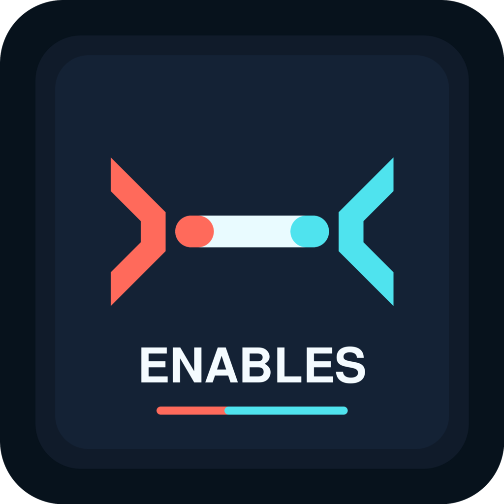

# Enables

Make Claude Code work with almost any AI provider.

Enables is a small local proxy that lets Claude Code sign in through an
Anthropic-compatible local endpoint while routing the actual model requests to
your chosen provider. Pick a provider, enter the API key, choose the model, and
Enables handles the endpoint and request translation.

Built by Lean Progress IQ and Dusan Milosevic, builder of Aura Code and Aura
Pulse. Enables follows the same practical direction: lightweight tooling,
direct workflows, and useful infrastructure for people who want more control
over the models behind their coding agents.

## Why

Claude Code expects the Anthropic Messages API. Many useful models are exposed
through OpenAI-compatible APIs instead. Enables bridges that gap:

- Claude Code talks to `http://localhost:8080/v1/messages`.
- Enables translates Anthropic Messages requests to the selected provider.
- The provider response is translated back into Claude Code's expected format.
- You keep the Claude Code workflow while choosing the upstream model.

## Current Features

- Interactive provider menu.
- Submenus for providers with multiple plans or endpoints.
- Hidden API key prompt with environment variable fallback.
- Saved local config in `~/.enables.json`.
- OpenAI-compatible provider adapter.
- Native Anthropic pass-through adapter.
- Streaming response conversion back to Anthropic SSE format.
- Tool-call translation between Anthropic and OpenAI-compatible formats.
- Custom OpenAI-compatible provider support.
- Automatic Claude Code launch with the correct local environment.
- Startup status showing the real provider, endpoint, and model in use.
- Terminal banner with Aura Code branding.

## Brand

<p align="center">
  
</p>

```text
      ◢◤                               ◢◤
   ╭─────────────────────────────────────────────────╮
   │   AURA   CODE                                   │
   │        E N A B L E S                            │
   │    local gateway for Claude Code                │
   ╰─────────────────────────────────────────────────╯
      ◥◣                               ◥◣
```

## Supported Providers

Enables includes presets for:

- DeepSeek
- OpenCode
  - Zen
  - Go
- Xiaomi MiMo
  - Token Plan
  - Pay as you go
- Zhipu GLM
- OpenAI
- Anthropic
- OpenRouter
- Groq
- xAI
- Google Gemini OpenAI-compatible endpoint
- Ollama
- Mistral AI
- Together AI
- Fireworks AI
- Perplexity
- Cerebras
- NVIDIA NIM
- Alibaba DashScope
- Moonshot AI / Kimi
- Baichuan
- Custom OpenAI-compatible endpoint

Provider presets live in [`src/providers.ts`](src/providers.ts).

## Install

```bash
npm install
npm run build
```

For local global usage during development:

```bash
npm run global
```

Then run:

```bash
enables
```

Or run directly from source:

```bash
npm run dev
```

## Usage

Start Enables:

```bash
enables
```

Then:

1. Choose a provider.
2. Choose the plan or endpoint variant if the provider has multiple options.
3. Enter the API key.
4. Choose the model.
5. Start Claude Code.

When the proxy starts, Enables prints the actual upstream configuration:

```text
Proxy on port 8080
Provider: Xiaomi MiMo / Token Plan
Model:    mimo-v2-flash
Endpoint: https://token-plan-sgp.xiaomimimo.com/v1

Claude Code: ANTHROPIC_BASE_URL=http://localhost:8080 ANTHROPIC_API_KEY=dummy
```

Claude Code uses the local Anthropic-compatible endpoint. Enables routes the
request to the provider and model shown in the startup status.

## Environment Variables

If a provider key is already available in the environment, Enables lets you
press Enter to use it instead of pasting the key again.

Examples:

```bash
export DEEPSEEK_API_KEY=sk-...
export XIAOMI_API_KEY=tp-...
export MIMO_PAYG_API_KEY=sk-...
export OPENROUTER_API_KEY=sk-or-...
export OPENAI_API_KEY=sk-proj-...
```

## Architecture

```text
Claude Code
  -> Anthropic Messages API request
  -> Enables local proxy
  -> Provider adapter
  -> Upstream model provider
  -> Enables response converter
  -> Anthropic-compatible response back to Claude Code
```

Main files:

- [`src/index.ts`](src/index.ts): CLI, provider setup, config, proxy server.
- [`src/providers.ts`](src/providers.ts): provider catalog, endpoints, models.
- [`src/translate.ts`](src/translate.ts): Anthropic to OpenAI-compatible request translation.
- [`src/reverse.ts`](src/reverse.ts): OpenAI-compatible response to Anthropic response conversion.

## Development

```bash
npm install
npm run build
npm run dev
```

The build output is written to `dist/`.

## Notes

Most non-Anthropic providers use the OpenAI-compatible adapter. Some providers
may still differ in streaming behavior, tool-call support, model names, or
extra headers. The `Custom OpenAI-compatible` option is available for providers
not yet listed.

## Credits

Enables is built by Lean Progress IQ and Dusan Milosevic.

Dusan Milosevic is also the builder of Aura Code and Aura Pulse. This project is
part of the same product direction: practical AI tooling that helps developers
choose their own model infrastructure without giving up the workflows they
already use.
